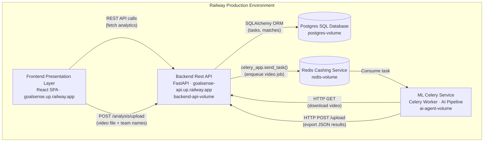
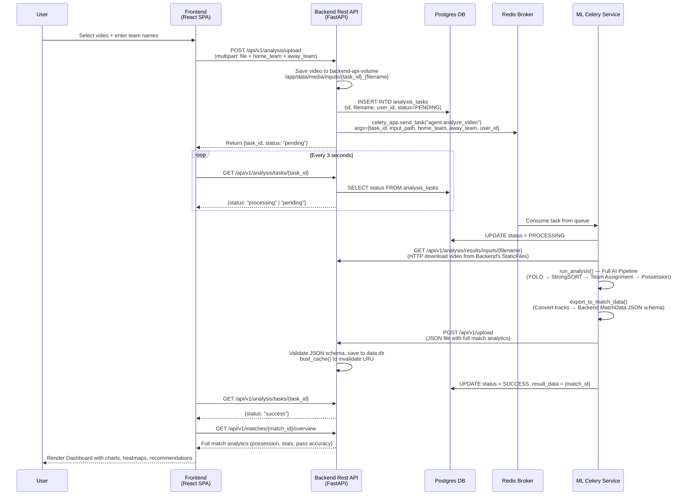
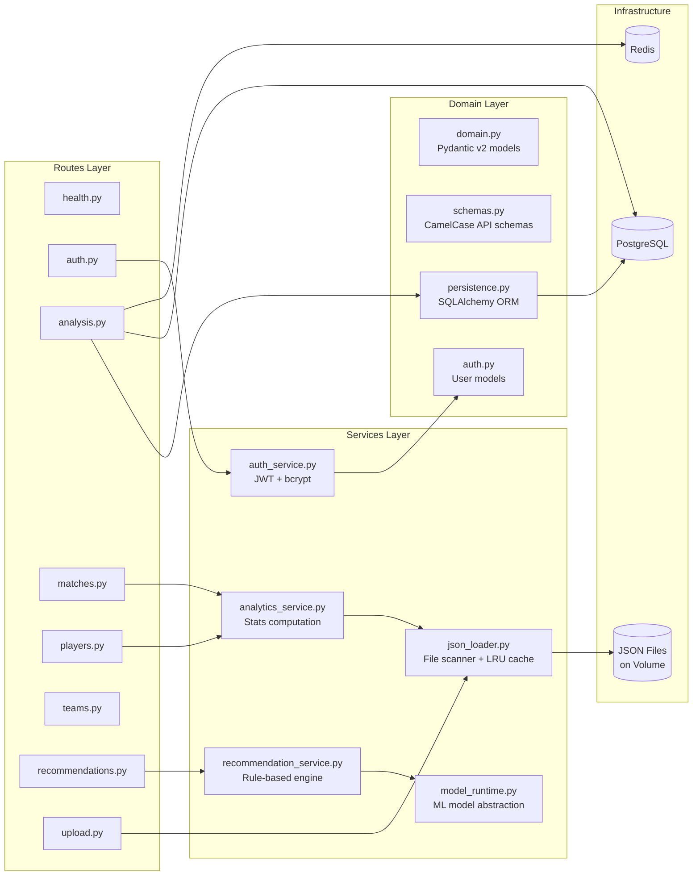

# GoalSense — AI Football Analytics Platform
## Graduation Project Presentation

---

## 1. Project Overview

**GoalSense** is a full-stack, microservices-based football analytics platform. Users upload match video → an AI worker processes it with computer vision → results appear on an interactive dashboard with heatmaps, stats, comparisons, and coaching recommendations.

> **My Responsibilities (Everything except the AI model itself):**
> - Full **Frontend** SPA (React 19 + TypeScript + Vite + Three.js)
> - Full **Backend** REST API (FastAPI + PostgreSQL + SQLAlchemy + JWT Auth)
> - **Agent Integration Layer** — Celery worker orchestration, data export schema bridge (`exporter.py`), pipeline enrichment, cross-container HTTP transfer
> - **Infrastructure & DevOps** — Docker containerization, Railway deployment (5 services), Vercel hosting
> - **Recommendation Engine** — Rule-based coaching insights generated from match analytics

---

## 2. Railway Production Architecture (5 Services)

This diagram matches the actual Railway dashboard deployment:



### Service Details

| Railway Service | Technology | Volume | Purpose |
|---|---|---|---|
| **Postgres SQL Database** | PostgreSQL | `postgres-volume` | Stores `analysis_tasks` table (task status, user_id) and `matches_persistence` |
| **Redis Cashing Service** | Redis | `redis-volume` | Celery message broker + result backend for async task queue |
| **Backend Rest API** | FastAPI + Uvicorn | `backend-api-volume` | REST API, JWT auth, video storage, JSON data persistence, static file serving |
| **ML Celery Service** | Celery + YOLO + OpenCV | `ai-agent-volume` | Consumes video tasks, runs AI pipeline, exports JSON back to Backend |
| **Frontend Presentation Layer** | React 19 + Vite | — | Interactive SPA dashboard served as static files |

---

## 3. End-to-End Data Flow (The Complete Pipeline)



---

## 4. User Stories

### US-01: User Registration & Login
> *As a coach, I want to create an account and log in so that my uploaded analyses are associated with my profile.*

- **Frontend:** `RegisterPage.tsx` / `LoginPage.tsx` → `AuthContext.tsx` stores JWT in localStorage
- **Backend:** `POST /api/v1/auth/register` and `POST /api/v1/auth/login` → bcrypt password hashing → JWT (HS256, 24h expiry) via `python-jose`
- **Protected Routes:** `ProtectedRoute.tsx` wraps all dashboard routes; `deps.py` extracts `user_id` from Bearer token

### US-02: Upload Match Video for AI Analysis
> *As a coach, I want to upload a match video with team names and have the AI automatically analyze it.*

- **Frontend:** `Upload.tsx` — drag-and-drop zone, team name inputs, mode toggle (Video / JSON)
- **Backend:** `analysis.py` — validates file type (.mp4/.avi/.mov), saves to volume, creates `AnalysisTask` in Postgres with `status=PENDING`, sends Celery task via Redis
- **Agent:** `worker.py` — downloads video via HTTP from Backend's StaticFiles endpoint, runs full pipeline, exports JSON, POSTs results back

### US-03: Real-Time Task Status Polling
> *As a user, I want to see the progress of my video analysis in real time.*

- **Frontend:** `Upload.tsx` polls `GET /analysis/tasks/{id}` every 3 seconds, renders `AnalysisPipeline.tsx` with animated status steps
- **Backend:** `analysis.py` reads task status from Postgres (`PENDING → PROCESSING → SUCCESS/FAILED`)
- **Agent:** `worker.py` updates Postgres directly via SQLAlchemy at each stage

### US-04: View Match Analysis Dashboard
> *As an analyst, I want to see a scoreboard, possession donut chart, stat bars, and a full statistics table for any analyzed match.*

- **Frontend:** `MatchAnalysis.tsx` — TeamShield badges, Recharts PieChart (possession), BarChart (stats comparison), stat breakdown table
- **Backend:** `AnalyticsService.match_overview()` computes possession from `PossessionSegment` data, pass accuracy from metadata stats, merges computed + metadata stats

### US-05: View Player Heatmaps
> *As a coach, I want to visualize where each player spent their time on the pitch.*

- **Frontend:** `Heatmaps.tsx` — 10×6 CSS grid overlaid on pitch markings, green intensity = zone density
- **Backend:** `AnalyticsService.player_heatmap()` reads pre-computed 3×3 `heatmap_zones` from player data (or falls back to coordinate bucketing / synthetic heatmaps)
- **Agent:** `exporter.py::_compute_heatmap_zones()` computes 3×3 grid from `position_transformed` data across all frames

### US-06: Compare Teams Head-to-Head
> *As an analyst, I want to compare two teams side by side with radar charts and stat tables.*

- **Frontend:** `Comparison.tsx` — radar chart (Recharts), head-to-head stat table, team shield badges

### US-07: View AI Recommendations
> *As a coach, I want actionable tactical insights generated from the match data.*

- **Frontend:** `Recommendations.tsx` + embedded section in `MatchAnalysis.tsx` — priority badges (high/medium/low), confidence scores, reasoning
- **Backend:** `RecommendationService` — rule-based engine with thresholds (rating ≥ 8.5, pass accuracy < 70%, turnover rate > 12%)
- **Agent:** `exporter.py::_compute_recommendations()` — generates recommendations at export time from actual tracking data (low distance, no ball involvement, high turnover ratio, low pass accuracy, team-level possession/turnovers)

### US-08: Export Analysis as PDF
> *As a coach, I want to download a full match report as a multi-page PDF.*

- **Frontend:** `MatchAnalysis.tsx` — uses `html-to-image` (toPng) + `jsPDF` to capture the page at 2x resolution, auto-paginate into A4 pages

### US-09: Delete Match Data
> *As a user, I want to remove old match analyses from my dashboard.*

- **Frontend:** `api.ts` — `api.matches.delete(id)` calls `DELETE /matches/{id}`

---

## 5. Backend Technical Architecture

### Layered Architecture (Routes → Services → Domain → Data)



### API Endpoints (Complete)

| Method | Endpoint | Auth | Description |
|---|---|---|---|
| `GET` | `/health` | No | Liveness check |
| `POST` | `/auth/register` | No | Create account, return JWT |
| `POST` | `/auth/login` | No | Authenticate, return JWT |
| `GET` | `/auth/me` | Yes | Current user profile |
| `POST` | `/analysis/upload` | Yes | Upload video → trigger Celery task |
| `GET` | `/analysis/tasks/{id}` | No | Poll task status from Postgres |
| `GET` | `/matches` | No | List all analyzed matches |
| `GET` | `/matches/{id}` | No | Match detail with events |
| `GET` | `/matches/{id}/overview` | No | Possession, pass accuracy, full stats |
| `DELETE` | `/matches/{id}` | No | Delete match data |
| `GET` | `/players` | No | List all players across matches |
| `GET` | `/players/{id}/stats` | No | Player detail with computed metrics |
| `GET` | `/players/{id}/heatmap` | No | Position heatmap zones |
| `GET` | `/teams` | No | List all teams |
| `GET` | `/teams/{id}` | No | Team detail with attributes |
| `GET` | `/teams/{id}/players` | No | Team roster |
| `GET` | `/teams/{id}/possession` | No | Possession % from latest match |
| `GET` | `/recommendations` | No | All recommendations |
| `GET` | `/recommendations/match/{id}` | No | Match-scoped recommendations |
| `GET` | `/recommendations/player/{id}` | No | Player-scoped recommendations |
| `POST` | `/upload` | No | Accept JSON match data (used by Agent) |

### Standardized API Response Envelope

```json
{
  "success": true,
  "data": { "...actual payload..." },
  "message": "OK",
  "timestamp": "2026-06-11T19:00:00+00:00"
}
```

### Domain Models (Pydantic v2 with Computed Fields)

| Model | Key Fields | Computed |
|---|---|---|
| `Position` | x (0-100%), y (0-100%), timestamp, minute | — |
| `Pass` | player_id, recipient_id, team_id, start/end coords, successful | `distance()`, `is_progressive()` |
| `Turnover` | player_id, team_id, x, y, turnover_type | — |
| `PlayerStats` | id, name, team_id, passes_attempted/completed, turnovers, rating, heatmap_zones, attributes | `pass_accuracy`, `turnover_rate` (computed fields) |
| `MatchData` | id, user_id, home/away team+score, players[], passes[], turnovers[], positions{}, possession_segments[], metadata | `team_possession()`, `player_lookup()` |
| `Recommendation` | scope (player/team/match), title, description, priority, confidence, reasoning, metrics | — |
| `AnalysisTask` | id, filename, user_id, status (PENDING/PROCESSING/SUCCESS/FAILED), result_data, error_message | — |

### Authentication Flow

1. **Registration:** `POST /auth/register` → bcrypt hash → store in `user_store` → return JWT
2. **Login:** `POST /auth/login` → verify bcrypt → create JWT (HS256, 24h)
3. **Protected endpoints:** `deps.py::get_current_user_id()` extracts user_id from `Authorization: Bearer <token>` header
4. **Frontend:** `AuthContext.tsx` persists token + user in localStorage, `ProtectedRoute.tsx` guards dashboard routes

---

## 6. Agent Integration Layer (My Work)

While I did not train the YOLO model, I built the entire integration layer that transforms raw AI output into structured analytics:

### `worker.py` — Celery Task Orchestration
- Downloads video from Backend via HTTP (cross-container transfer)
- Calls `run_analysis()` from the AI pipeline
- Calls `export_to_match_data()` to convert raw tracks into Backend schema
- POSTs final JSON back to Backend's `/api/v1/upload`
- Updates task status in Postgres at each step (PENDING → PROCESSING → SUCCESS/FAILED)

### `exporter.py` — Schema Bridge (587 lines)
The core integration I built. Converts raw YOLO tracking dicts into the Backend's `MatchData` JSON format:

1. **Pass Detection & Turnover Detection** — calls `detect_passes()` / `assign_ball_touches()` from `json_extractor.py`
2. **Possession Calculation** — counts team_1 vs team_2 frames from `team_ball_control` numpy array
3. **Coordinate Normalization** — converts metre coordinates (0-23.32m × 0-68m) to percentage (0-100%)
4. **Backend Pass/Turnover Objects** — builds typed objects with normalized coordinates
5. **Position Tracking** — per-player position arrays with normalized x/y
6. **Possession Segments** — time-based segments for the `PossessionSegment` domain model
7. **Heatmap Zone Computation** — 3×3 grid from `position_transformed` data across all frames
8. **Player Attribute Derivation** — speed and passing ratings from tracking stats
9. **Metadata Stats** — Passes, Turnovers, Possession %, Pass Accuracy per team
10. **Recommendation Generation** — coaching insights computed from the tracking data
11. **JSON Serialization** — handles numpy types, saves to disk, pushes to Backend

### `pipeline_enrichment.py` — Post-Pipeline Processing
- `add_time_to_tracks()` — adds time (seconds) to every tracking entry
- `add_velocity_to_tracks()` — computes vx, vy, speed_mps, direction_deg per frame
- `compute_ball_interpolation_mask()` + `apply_interpolation_flags()` — marks real vs interpolated ball detections
- `add_ball_state()` — tags ball with `in_play`/`out_of_bounds` and `possessed_by`
- `detect_tackles()` / `detect_fouls()` — rule-based event detection from tracking data

### Cross-Container Data Transfer Pattern

```
Backend Container (backend-api-volume)          Agent Container (ai-agent-volume)
├── /app/data/media/inputs/{video}              ├── /app/data/media/inputs/{video}
│   (user uploads here)                         │   (downloaded via HTTP GET)
│                                               │
│   StaticFiles served at:                      │   Agent downloads from:
│   GET /api/v1/analysis/results/inputs/...     │   {BACKEND_API_URL}/api/v1/analysis/results/...
│                                               │
├── /app/data/media/{match}.json                ├── /app/data/{match}.json
│   (received via POST /upload)         ←────   │   (exported locally, then HTTP POST to Backend)
```

---

## 7. Frontend Technical Architecture

### Technology Stack

| Library | Version | Purpose |
|---|---|---|
| React | 19.2 | UI framework |
| TypeScript | 5.9 | Type safety |
| Vite | 7.3 | Build tool |
| Tailwind CSS | 4.2 | Utility-first styling |
| Framer Motion | 12.35 | Page transitions, micro-animations |
| Recharts | 3.8 | Pie charts, bar charts, radar charts |
| Three.js | 0.184 | 3D football scene on landing page |
| Lenis | 1.3 | Smooth scroll |
| jsPDF + html-to-image | Latest | Multi-page PDF export |
| React Router | 7.13 | SPA routing with AnimatePresence |
| react-hot-toast | 2.6 | Toast notifications |
| Lucide React | 0.577 | Icon library |

### Design System (CSS Custom Properties)

| Token | Value | Usage |
|---|---|---|
| `--background` | `#080c10` | Page background |
| `--surface` | `#0d1117` | Card backgrounds |
| `--surface-2` | `#141b24` | Elevated surfaces |
| `--border` | `#1c2535` | Borders |
| `--primary` | `#00e676` | Accent (emerald green) |
| `--foreground` | `#dde3ec` | Text |
| `--muted` | `#4a5c72` | Secondary text |
| Font Display | Space Grotesk | Headlines |
| Font Sans | Inter | Body text |
| Font Mono | Fira Code | Labels, stats |

### Visual Effects
- **WebGL Background** — custom shader on landing hero (`WebGLBackground.tsx`)
- **3D Football Scene** — Three.js rendered player model (`ThreeScene.tsx`)
- **Custom Cursor** — replaces native cursor with animated dot (`CustomCursor.tsx`)
- **Grain Overlay** — SVG noise texture at 3% opacity via CSS `::before`
- **Blur-In Animations** — scroll-triggered blur→focus entrance (`BlurIn.tsx`)
- **Page Transitions** — Framer Motion `AnimatePresence` with `mode="wait"`
- **Smooth Scrolling** — Lenis library for momentum scrolling

### Component Library

| Component | Purpose |
|---|---|
| `GlassCard` | Frosted glass container (`bg-surface/80 backdrop-blur-md`) |
| `BlurIn` | Scroll-triggered animation wrapper |
| `StatCard` | Numeric stat display with optional green glow |
| `SectionLabel` | Monospace section header (e.g. `[01] ~/heatmaps`) |
| `TeamShield` | SVG shield badge with team initial + gradient |
| `Navbar` | Fixed glassmorphism nav with `FullscreenMenu` mobile overlay |
| `PageTransition` | Framer Motion wrapper for route transitions |
| `AnalysisPipeline` | Animated step-by-step pipeline tracker during upload |
| `Charts` | Recharts wrappers for donut, bar, radar charts |
| `Modal` | Glassmorphism modal overlay |

### Page Architecture (15 Pages)

| Page | Route | Key Features |
|---|---|---|
| Landing | `/` | WebGL hero, 3D scene, feature cards, "How it works" steps, CTA |
| Login | `/login` | Email/password form → JWT storage |
| Register | `/register` | Name/email/password → auto-login |
| Dashboard | `/dashboard` | Match list, team stats, recent activity (protected) |
| Upload | `/upload` | Drag-drop zone, Video/JSON toggle, team name inputs, pipeline tracker (protected) |
| Match Analysis | `/analysis/:id?` | Scoreboard, possession donut, bar chart, stat table, recommendations, PDF export (protected) |
| Heatmaps | `/heatmaps/:id?` | Player selector, 10×6 pitch grid, attribute profile bars (protected) |
| Comparison | `/comparison` | Radar chart, head-to-head table (protected) |
| Recommendations | `/recommendations` | Priority-sorted insight cards (protected) |
| Player Profile | `/player/:id` | Individual stats, radar chart (protected) |
| Team Details | `/team/:id` | Roster, team attributes (protected) |
| Settings | `/settings` | User preferences (protected) |
| About | `/about` | Project information |
| Support | `/help` | Help & FAQ |
| 404 | `*` | Animated not-found page |

---

## 8. Recommendation Engine (Dual-Layer)

Recommendations are generated at **two levels**:

### Layer 1: Agent-Side (at export time in `exporter.py`)
Generated from **real tracking data** during video analysis:
- **Low Distance** — player covered < 50% of team average
- **No Ball Involvement** — zero passes + zero turnovers despite covering distance
- **High Turnover Rate** — > 40% of involvements lost
- **Low Pass Accuracy** — < 60% completion
- **Top Speed** — top 3 fastest players per team (leverage in transitions)
- **Team Low Possession** — < 40% possession
- **Team High Turnovers** — > 50% turnover ratio
- **Team Low Pass Accuracy** — < 60% team completion

### Layer 2: Backend-Side (`RecommendationService`)
Additional rule-based insights computed by the Backend:
- **Top Performer** — rating ≥ 8.5
- **Needs Improvement** — pass accuracy < 70% or turnover rate > 12%
- **Opposing Threats** — top 3 opposition players by rating
- **Team Tactics** — defensive transitions, shot conversion, ball circulation, set-piece strategy

### Future: ML Model Injection
The `ModelRuntime` class provides a plug-in abstraction for replacing rules with trained ML models:
```python
model_runtime.load("your_model.joblib")  # scikit-learn compatible
predictions = model_runtime.predict(features)  # auto-routes through model
```

---

## 9. Testing & Quality

### Backend Test Suite (44 tests, 7 files)

| Test File | Coverage |
|---|---|
| `test_health.py` | App startup, health endpoint, CORS headers |
| `test_matches.py` | List, detail, overview, 404 handling |
| `test_players.py` | List, detail, stats, heatmap, 404 handling |
| `test_teams.py` | List, detail, roster, possession aggregation |
| `test_recommendations.py` | All scopes, ML fallback verification |
| `test_json_loader.py` | Missing file, invalid JSON, upload accept/reject |
| `test_analytics.py` | Pass accuracy math, heatmap coordinates, pass distance |

### Security Measures
- **Upload validation** — only `.json` files accepted by `/upload` (no pickle/joblib)
- **Video validation** — only `.mp4/.avi/.mov` accepted by `/analysis/upload`
- **Path traversal protection** — `ModelRuntime` enforces model loading from controlled directory
- **JWT secrets** — configurable via environment variables
- **CORS** — restrictive origin whitelist
- **Password hashing** — bcrypt via passlib

---

## 10. Docker & Deployment

### Agent Dockerfile (Key Design Decisions)
```dockerfile
FROM python:3.11-slim
# CPU-only PyTorch (avoids 2GB CUDA download)
RUN pip install torch torchvision --index-url https://download.pytorch.org/whl/cpu
# Download YOLO model at build time (cached Docker layer)
RUN gdown --id 1LwYwMcKMyD4ES_IBbmTigqO8QOlyW8vH -O football_analysis/models/best.pt
# Single-worker Celery (8GB RAM constraint)
CMD ["celery", "-A", "worker.worker_app", "worker", "--loglevel=info", "--concurrency=1"]
```

### Memory Management (8GB Railway Limit)
- Video frames resized to 720p if > 720 height
- `_free_memory()` calls `gc.collect()` + `malloc_trim(0)` (glibc) to return pages to OS
- YOLO model + StrongSORT freed immediately after tracking completes
- Raw video frames freed before enrichment
- Annotated frames freed after video save
- Single Celery worker (`--concurrency=1`) to prevent parallel memory spikes

### Environment Variables

| Variable | Service | Purpose |
|---|---|---|
| `DATABASE_URL` | Backend + Agent | PostgreSQL connection string |
| `REDIS_URL` | Backend + Agent | Redis connection for Celery broker |
| `CORS_ORIGINS` | Backend | Allowed frontend origins |
| `JWT_SECRET_KEY` | Backend | HMAC signing key for JWT tokens |
| `BACKEND_API_URL` | Agent | Backend public URL for video download (`https://goalsense-api.up.railway.app`) |
| `VITE_API_BASE_URL` | Frontend | Backend API URL for fetch calls |

---

## 11. Key Technical Challenges Solved

1. **Cross-Container File Transfer** — Backend and Agent run in separate containers with separate volumes. Solved by serving uploads via FastAPI `StaticFiles` and having the Agent download via HTTP, then POST results back.

2. **8GB Memory Constraint** — Full AI pipeline (YOLO + StrongSORT + OpenCV) on Railway's 8GB limit. Solved with aggressive frame-level GC, 720p downscaling, model unloading after use, and `malloc_trim(0)`.

3. **Schema Bridge** — Converting raw YOLO tracking dicts (pixel coordinates, numpy arrays, integer IDs) into a structured, validated `MatchData` JSON schema understood by the Backend's Pydantic v2 domain models. The 587-line `exporter.py` handles coordinate normalization, possession calculation, heatmap zone computation, and recommendation generation.

4. **Async Video Processing** — Users need immediate feedback but video processing takes minutes. Solved with Celery + Redis task queue, Postgres status tracking, and frontend polling with animated pipeline visualization.

5. **Data Accuracy** — Pass accuracy from the AI's `successful` flag was always `True`. Solved by computing pass accuracy from the ratio of passes to turnovers in the metadata stats, and preferring those values in `AnalyticsService`.
